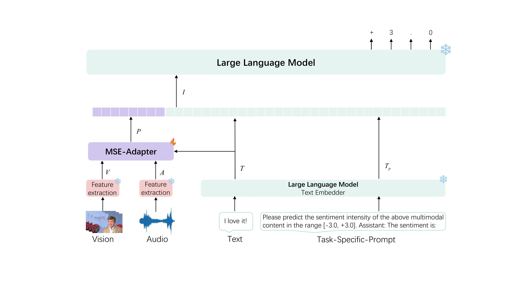
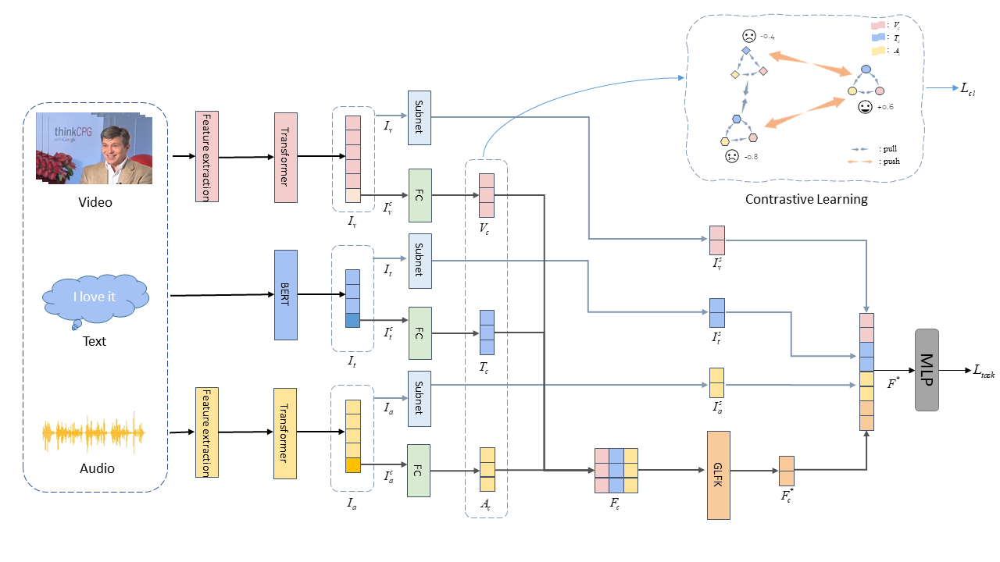

For full paper list, please refer to my [Google Scholar](https://scholar.google.com/citations?user=ueMAa5wAAAAJ&hl=zh-CN).

<!-- - *<strong><strong>Yang Yang</strong></strong>, Xunde Dong, and Yupeng Qiang. 2025. MSE-Adapter: A Lightweight Plugin Endowing LLMs with the Capability to Perform Multimodal Sentiment Analysis and Emotion Recognition. Proceedings of the AAAI Conference on Artificial Intelligence, 39(24), 25642-25650. <strong><strong>(AAAI 2025)</strong></strong>.* [[Paper]](https://ojs.aaai.org/index.php/AAAI/article/download/34755/36910)[[arXiv]](https://arxiv.org/pdf/2502.12478)

- *<strong><strong>Yang Yang</strong></strong>, Xunde Dong, and Yupeng Qiang. 2024. CLGSI: A Multimodal Sentiment Analysis Framework based on Contrastive Learning Guided by Sentiment Intensity. In Findings of the Association for Computational Linguistics: NAACL 2024, pages 2099–2110, Mexico City, Mexico. Association for Computational Linguistics. <strong><strong>(NAACL Findings 2024)</strong></strong>.* [[Paper]](https://aclanthology.org/2024.findings-naacl.135.pdf) -->

<!DOCTYPE html>
<html lang="en">

<head>
  <meta charset="UTF-8">
  <meta name="viewport" content="width=device-width, initial-scale=1.0">
  
</head>

<body>
  <!-- 第一篇论文 -->
  

    

      

        AAAI 2025
      

      
    

    

      <h2 class="paper-title">MSE-Adapter: A Lightweight Plugin Endowing LLMs with the Capability to Perform Multimodal Sentiment Analysis and Emotion Recognition</h2>
      

        <strong>Yang Yang</strong>, Xunde Dong, and Yupeng Qiang.
      

      

        Proceedings of the AAAI Conference on Artificial Intelligence, 39(24), 25642-25650. <strong>(AAAI 2025)</strong>
      

    

    

      <a href="https://ojs.aaai.org/index.php/AAAI/article/download/34755/36910" class="button">Paper</a>
      <a href="https://arxiv.org/pdf/2502.12478" class="button">arXiv</a>
    

  

  <!-- 第二篇论文 -->
  

    

      

        NAACL 2024 Findings
      

      
    

    

      <h2 class="paper-title">CLGSI: A Multimodal Sentiment Analysis Framework based on Contrastive Learning Guided by Sentiment Intensity</h2>
      

        <strong>Yang Yang</strong>, Xunde Dong, and Yupeng Qiang.
      

      

        In Findings of the Association for Computational Linguistics: NAACL 2024, pages 2099–2110, Mexico City, Mexico. Association for Computational Linguistics. <strong>(NAACL Findings 2024)</strong>
      

    

    

      <a href="https://aclanthology.org/2024.findings-naacl.135.pdf" class="button">Paper</a>
    

  

</body>

</html>